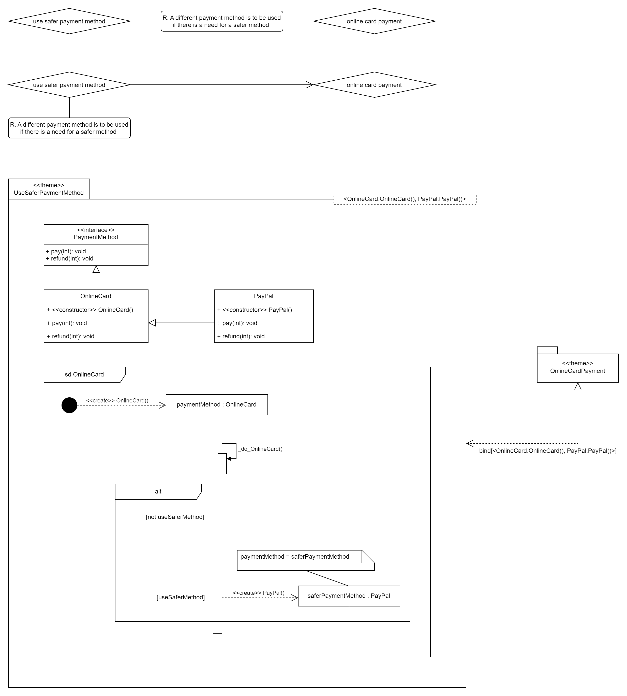

# Cuckoo's Egg Design Pattern Implementation in AspectJ

Author: Bc. Viktor Modroczký\
Course: Aspect-oriented Software Development @ FIIT STU

## Proof of Concept

The proof of concept contains an interface called `PaymentMethod` containing methods
`pay` and `refund` which is implemented by the `OnlineCard` class overriding the `pay` and
`refund` methods. The `PayPal` class inherits from `OnlineCard` and overrides its
`pay` and `refund` methods.

The aspect `UseSaferPaymentMethod`contains a pointcut `paymentMethodConstructor()`
that follows the `OnlineCard` constructor call join point. The aspect also contains a boolean variable
`useSaferMethod`, which, if set to `true`, will cause the `around()` advice to call the
`PayPal` constructor and return the created `PayPal` instance, and if set to `false`, will
cause the `around()` advice to return `proceed()`, which is of class `OnlineCard`.

In the `Main` class, we create an instance of `PayPal` and call its `pay` and `refund`
methods and then print the class name, which is `PayPal`.

Next, we create an instance of `OnlineCard` and call its `pay` and `refund` methods and
then print the class name, which is `OnlineCard` if `useSaferMethod` is set to `false`
and `PayPal` if `useSaferMethod` is set to `true`.

If `useSaferMethod` is set to `true`, the output will be:

```text
PayPal payment of 100$ processed.
PayPal refund of 100$ processed.
Class of paypal object is PayPal.

Changing OnlineCard class to PayPal class.
PayPal payment of 200$ processed.
PayPal refund of 200$ processed.
Class of onlineCard object is PayPal.
```

If `useSaferMethod` is set to `false`, the output will be:

```text
PayPal payment of 100$ processed.
PayPal refund of 100$ processed.
Class of paypal object is PayPal.

Using OnlineCard class.
Online card payment of 200$ processed.
Online card refund of 200$ processed.
Class of onlineCard object is OnlineCard.
```

This proves that the aspect is working as intended and that we successfully implemented
the Cuckoo's Egg design pattern to change an object's class at runtime.

## Theme/Doc and Theme/UML Diagram

